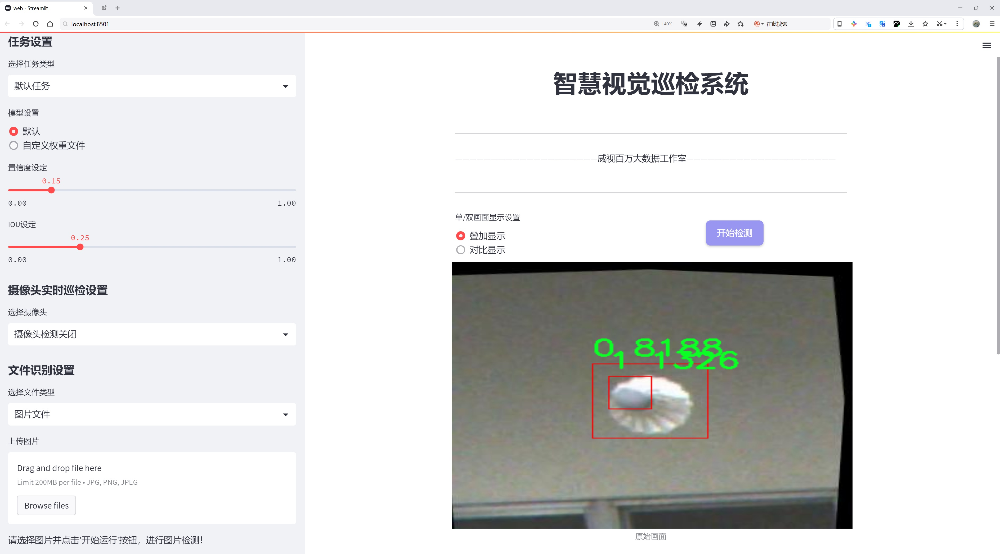
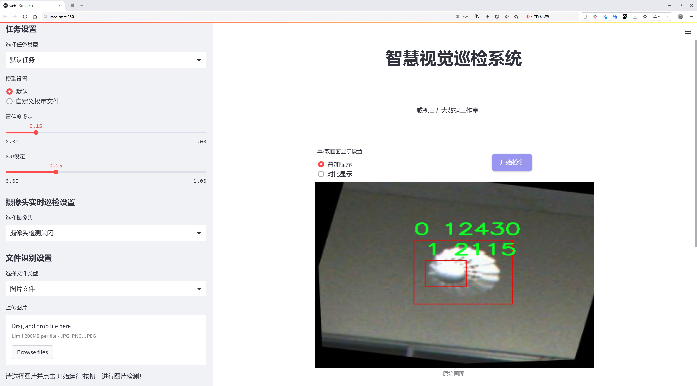
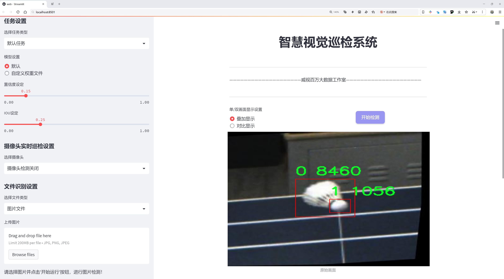
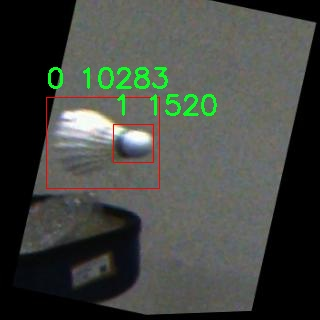
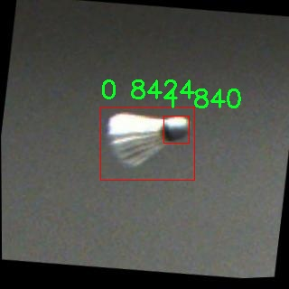
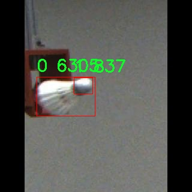
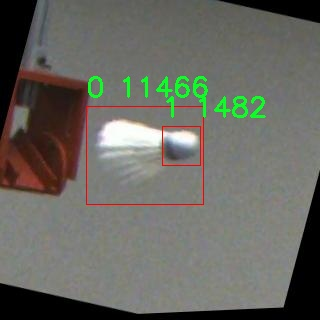
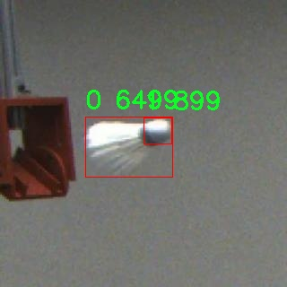

# 羽毛球关键点检测检测系统源码分享
 # [一条龙教学YOLOV8标注好的数据集一键训练_70+全套改进创新点发刊_Web前端展示]

### 1.研究背景与意义

项目参考[AAAI Association for the Advancement of Artificial Intelligence](https://gitee.com/qunshansj/projects)

项目来源[AACV Association for the Advancement of Computer Vision](https://gitee.com/qunmasj/projects)

研究背景与意义

随着计算机视觉技术的迅猛发展，物体检测领域逐渐成为了研究的热点之一。尤其是在体育领域，运动员的动作分析、比赛策略的制定以及运动表现的提升都离不开对运动关键点的精确检测。羽毛球作为一项技术性和竞技性兼备的运动，其运动员在比赛中的动作复杂多变，涉及到快速的移动、精准的击球以及灵活的身体协调。因此，开发一个高效的羽毛球关键点检测系统，对于提升运动员的训练效果、优化比赛策略、甚至是推动羽毛球运动的普及与发展，都具有重要的现实意义。

本研究旨在基于改进的YOLOv8模型，构建一个高效的羽毛球关键点检测系统。YOLO（You Only Look Once）系列模型因其高效的实时检测能力和良好的检测精度，广泛应用于各种物体检测任务中。YOLOv8作为该系列的最新版本，结合了深度学习的最新进展，具有更强的特征提取能力和更快的推理速度。通过对YOLOv8的改进，我们希望能够进一步提升其在羽毛球关键点检测中的表现，尤其是在复杂背景和快速运动的场景下。

在本研究中，我们使用的数据集“ball_320”包含1600张图像，涵盖了两个主要类别。这些图像不仅为模型的训练提供了丰富的样本，还为后续的模型评估和优化奠定了基础。数据集的多样性和代表性使得模型能够在不同的环境和条件下进行有效的学习，从而提高其在实际应用中的鲁棒性和准确性。通过对数据集的深入分析，我们将能够识别出羽毛球运动中关键的动作模式和关键点，从而为运动员的技术提升提供数据支持。

此外，羽毛球运动的关键点检测不仅仅是一个技术问题，更是一个涉及到运动科学、训练方法和比赛策略的综合性研究课题。通过对羽毛球运动员在比赛中关键动作的检测与分析，我们可以深入理解运动员的运动机制，进而为教练员提供科学的训练指导，帮助运动员优化技术动作，提高比赛表现。这一研究不仅有助于提升羽毛球运动的竞技水平，还有助于推动相关运动科学研究的发展。

综上所述，基于改进YOLOv8的羽毛球关键点检测系统的研究，不仅在技术上具有重要的创新意义，也在实际应用中具有广泛的社会价值。通过这一研究，我们期望能够为羽毛球运动的训练与发展提供新的思路和方法，为运动员的成长与进步贡献力量。

### 2.图片演示







##### 注意：由于此博客编辑较早，上面“2.图片演示”和“3.视频演示”展示的系统图片或者视频可能为老版本，新版本在老版本的基础上升级如下：（实际效果以升级的新版本为准）

  （1）适配了YOLOV8的“目标检测”模型和“实例分割”模型，通过加载相应的权重（.pt）文件即可自适应加载模型。

  （2）支持“图片识别”、“视频识别”、“摄像头实时识别”三种识别模式。

  （3）支持“图片识别”、“视频识别”、“摄像头实时识别”三种识别结果保存导出，解决手动导出（容易卡顿出现爆内存）存在的问题，识别完自动保存结果并导出到tempDir中。

  （4）支持Web前端系统中的标题、背景图等自定义修改，后面提供修改教程。

  另外本项目提供训练的数据集和训练教程,暂不提供权重文件（best.pt）,需要您按照教程进行训练后实现图片演示和Web前端界面演示的效果。

### 3.视频演示

[3.1 视频演示](https://www.bilibili.com/video/BV1814veVE1o/)

### 4.数据集信息展示

##### 4.1 本项目数据集详细数据（类别数＆类别名）

nc: 2
names: ['0', '1']


##### 4.2 本项目数据集信息介绍

数据集信息展示

在本研究中，我们使用了名为“ball_320”的数据集，以训练和改进YOLOv8模型，旨在实现羽毛球关键点的高效检测。该数据集专门为羽毛球运动的分析与研究而设计，涵盖了与羽毛球相关的关键特征和动态表现。数据集的类别数量为2，分别用数字“0”和“1”标识，这两个类别在羽毛球运动中具有重要的意义。具体而言，类别“0”可能代表羽毛球的运动轨迹或特定的击球动作，而类别“1”则可能指代运动员的身体关键点或羽毛球拍的持握位置等。这种分类方式为模型提供了清晰的目标，使其能够在复杂的运动场景中准确识别和定位关键点。

“ball_320”数据集的构建过程充分考虑了羽毛球运动的多样性和复杂性。数据集中包含了大量的图像和视频片段，记录了不同场景下的羽毛球比赛和训练过程。这些数据不仅涵盖了各种击球动作，还包括运动员在不同角度、不同光照条件下的表现，确保了数据集的多样性和代表性。通过这种方式，模型能够学习到在真实比赛中可能遇到的各种情况，从而提高其在实际应用中的鲁棒性和准确性。

此外，数据集中的图像经过精心标注，确保每个关键点的位置信息准确无误。这些标注不仅包括羽毛球的运动轨迹，还涵盖了运动员的各个身体部位，如手、脚、头等，形成了一个完整的关键点检测体系。这种细致的标注方式使得模型在训练过程中能够获得丰富的上下文信息，从而提升其对羽毛球运动动态的理解能力。

在训练过程中，我们采用了数据增强技术，以进一步提升模型的泛化能力。通过对“ball_320”数据集中的图像进行旋转、缩放、裁剪等操作，我们能够生成更多的训练样本，帮助模型适应不同的场景变化。这种数据增强策略不仅提高了模型的训练效率，还有效降低了过拟合的风险，使得模型在面对未见过的数据时，依然能够保持较高的检测精度。

总之，“ball_320”数据集为羽毛球关键点检测系统的训练提供了坚实的基础。通过对该数据集的深入分析与应用，我们期望能够显著提升YOLOv8模型在羽毛球运动中的关键点检测能力，从而为运动员的训练与比赛分析提供更为精准的技术支持。随着研究的深入，我们相信这一数据集将为羽毛球运动的智能化发展贡献重要的力量。











### 5.全套项目环境部署视频教程（零基础手把手教学）

[5.1 环境部署教程链接（零基础手把手教学）](https://www.ixigua.com/7404473917358506534?logTag=c807d0cbc21c0ef59de5)


[5.2 安装Python虚拟环境创建和依赖库安装视频教程链接（零基础手把手教学）](https://www.ixigua.com/7404474678003106304?logTag=1f1041108cd1f708b01a)

### 6.手把手YOLOV8训练视频教程（零基础小白有手就能学会）

[6.1 手把手YOLOV8训练视频教程（零基础小白有手就能学会）](https://www.ixigua.com/7404477157818401292?logTag=d31a2dfd1983c9668658)

### 7.70+种全套YOLOV8创新点代码加载调参视频教程（一键加载写好的改进模型的配置文件）

[7.1 70+种全套YOLOV8创新点代码加载调参视频教程（一键加载写好的改进模型的配置文件）](https://www.ixigua.com/7404478314661806627?logTag=29066f8288e3f4eea3a4)

### 8.70+种全套YOLOV8创新点原理讲解（非科班也可以轻松写刊发刊，V10版本正在科研待更新）

由于篇幅限制，每个创新点的具体原理讲解就不一一展开，具体见下列网址中的创新点对应子项目的技术原理博客网址【Blog】：


[8.1 70+种全套YOLOV8创新点原理讲解链接](https://gitee.com/qunmasj/good)

### 9.系统功能展示（检测对象为举例，实际内容以本项目数据集为准）

图9.1.系统支持检测结果表格显示

  图9.2.系统支持置信度和IOU阈值手动调节

  图9.3.系统支持自定义加载权重文件best.pt(需要你通过步骤5中训练获得)

  图9.4.系统支持摄像头实时识别

  图9.5.系统支持图片识别

  图9.6.系统支持视频识别

  图9.7.系统支持识别结果文件自动保存

  图9.8.系统支持Excel导出检测结果数据


### 10.原始YOLOV8算法原理

原始YOLOv8算法原理

YOLO（You Only Look Once）系列算法自其首次提出以来，便以其高效的目标检测能力和简洁的架构吸引了广泛的关注。YOLOv8作为该系列的最新版本，继承并改进了前几代算法的优点，展现出更为卓越的性能和灵活性。YOLOv8的设计理念依然是将目标检测任务视为一个回归问题，通过一个单一的神经网络模型同时预测目标的位置和类别。然而，YOLOv8在多个方面进行了创新，特别是在网络结构、特征融合和损失函数的设计上，使其在训练时间和检测精度上都得到了显著提升。

YOLOv8的网络结构主要由三个部分组成：主干网络（backbone）、特征增强网络（neck）和检测头（head）。主干网络采用了CSP（Cross Stage Partial）思想，继续使用YOLOv5中的CSPDarknet架构，但对C3模块进行了替换，采用了更为轻量化的C2f模块。这一模块的设计灵感来源于YOLOv7的ELAN（Efficient Layer Aggregation Network）结构，旨在通过增加短路连接来缓解深层网络中的梯度消失问题，从而增强特征的重用能力和信息流动性。C2f模块由多个CBS（Convolution + Batch Normalization + SiLU）卷积模块和若干个Bottleneck组成，能够在保持输入输出特征图尺寸一致的同时，提取出更加丰富的特征信息。

在特征增强网络方面，YOLOv8采用了PAN-FPN（Path Aggregation Network - Feature Pyramid Network）结构，旨在实现多尺度特征的有效融合。该结构通过自下而上的高层特征与中层、浅层特征的融合，增强了模型对不同尺度目标的检测能力。具体而言，YOLOv8在上采样阶段直接将高层特征与中层特征进行拼接，并通过C2f模块进一步处理，确保细节信息与语义信息的充分结合。这种设计使得YOLOv8能够在复杂场景中更准确地定位目标，并提高了对小目标的检测能力。

检测头部分，YOLOv8引入了解耦头的概念，将目标分类和边框回归分为两个独立的分支。这一创新的设计使得每个任务能够更加专注于自身的目标，从而有效地解决了复杂场景下的定位不准和分类错误的问题。YOLOv8的检测头采用了Anchor-free的方法，摒弃了传统的Anchor-based策略，直接通过回归方式预测目标的位置和大小。这种方法的优势在于，它不再依赖于预先定义的锚框，从而简化了模型的设计，并提高了对不同尺度和形状目标的适应能力。

在损失函数的设计上，YOLOv8使用了VFLLoss作为分类损失，DFLLoss与CIoULoss作为回归损失。这种组合损失函数的选择，旨在更好地平衡分类和回归任务之间的关系，提升模型的整体性能。此外，YOLOv8还采用了Task-Aligned的样本匹配策略，取代了以往的静态匹配方式，使得模型在训练过程中能够更加灵活地适应不同的任务需求。

在数据预处理方面，YOLOv8延续了YOLOv5的策略，采用了多种数据增强手段，如马赛克增强、混合增强、空间扰动和颜色扰动等。这些增强手段的引入，旨在提高模型的鲁棒性和泛化能力，使其在实际应用中能够更好地应对各种复杂场景。

YOLOv8的轻量化设计使得其模型权重文件相比于前几代YOLO算法更加小巧，能够在嵌入式设备上进行高效部署。这一特性使得YOLOv8在实时检测任务中表现出色，能够满足对速度和精度的双重需求。

综上所述，YOLOv8在目标检测领域的创新和改进，使其成为一种强大的工具，能够有效应对各种复杂的目标检测任务。通过对网络结构的优化、特征融合的增强以及损失函数的改进，YOLOv8不仅提升了检测精度，还显著缩短了训练时间，展现出更为卓越的性能。这些特点使得YOLOv8在实际应用中具备了广泛的适用性，成为目标检测领域的又一重要里程碑。


### 11.项目核心源码讲解（再也不用担心看不懂代码逻辑）

#### 11.1 code\ultralytics\data\split_dota.py

以下是代码中最核心的部分，并添加了详细的中文注释：

```python
import itertools
from glob import glob
from math import ceil
from pathlib import Path
import cv2
import numpy as np
from PIL import Image
from tqdm import tqdm
from shapely.geometry import Polygon

def bbox_iof(polygon1, bbox2, eps=1e-6):
    """
    计算两个边界框的交并比（IOF）。

    参数:
        polygon1 (np.ndarray): 多边形坐标，形状为(n, 8)。
        bbox2 (np.ndarray): 边界框，形状为(n, 4)。
    返回:
        outputs (np.ndarray): 交并比结果。
    """
    polygon1 = polygon1.reshape(-1, 4, 2)  # 将多边形坐标重塑为4个点的形状
    lt_point = np.min(polygon1, axis=-2)  # 左上角点
    rb_point = np.max(polygon1, axis=-2)  # 右下角点
    bbox1 = np.concatenate([lt_point, rb_point], axis=-1)  # 生成边界框

    # 计算重叠区域
    lt = np.maximum(bbox1[:, None, :2], bbox2[..., :2])
    rb = np.minimum(bbox1[:, None, 2:], bbox2[..., 2:])
    wh = np.clip(rb - lt, 0, np.inf)  # 确保宽高非负
    h_overlaps = wh[..., 0] * wh[..., 1]  # 计算重叠面积

    # 生成多边形
    l, t, r, b = (bbox2[..., i] for i in range(4))
    polygon2 = np.stack([l, t, r, t, r, b, l, b], axis=-1).reshape(-1, 4, 2)

    sg_polys1 = [Polygon(p) for p in polygon1]  # 将多边形转换为shapely对象
    sg_polys2 = [Polygon(p) for p in polygon2]
    overlaps = np.zeros(h_overlaps.shape)  # 初始化重叠面积数组
    for p in zip(*np.nonzero(h_overlaps)):  # 遍历重叠区域
        overlaps[p] = sg_polys1[p[0]].intersection(sg_polys2[p[-1]]).area  # 计算交集面积
    unions = np.array([p.area for p in sg_polys1], dtype=np.float32)  # 计算多边形面积
    unions = unions[..., None]

    unions = np.clip(unions, eps, np.inf)  # 避免除以零
    outputs = overlaps / unions  # 计算IOF
    if outputs.ndim == 1:
        outputs = outputs[..., None]
    return outputs

def load_yolo_dota(data_root, split="train"):
    """
    加载DOTA数据集。

    参数:
        data_root (str): 数据根目录。
        split (str): 数据集分割，可以是'train'或'val'。
    返回:
        annos (list): 包含图像和标签信息的字典列表。
    """
    assert split in ["train", "val"]
    im_dir = Path(data_root) / "images" / split  # 图像目录
    assert im_dir.exists(), f"Can't find {im_dir}, please check your data root."
    im_files = glob(str(Path(data_root) / "images" / split / "*"))  # 获取图像文件
    lb_files = img2label_paths(im_files)  # 获取标签文件路径
    annos = []
    for im_file, lb_file in zip(im_files, lb_files):
        w, h = exif_size(Image.open(im_file))  # 获取图像的原始尺寸
        with open(lb_file) as f:
            lb = [x.split() for x in f.read().strip().splitlines() if len(x)]  # 读取标签
            lb = np.array(lb, dtype=np.float32)  # 转换为numpy数组
        annos.append(dict(ori_size=(h, w), label=lb, filepath=im_file))  # 存储信息
    return annos

def get_windows(im_size, crop_sizes=[1024], gaps=[200], im_rate_thr=0.6, eps=0.01):
    """
    获取图像的窗口坐标。

    参数:
        im_size (tuple): 原始图像尺寸，(h, w)。
        crop_sizes (List(int)): 窗口的裁剪尺寸。
        gaps (List(int)): 窗口之间的间隔。
        im_rate_thr (float): 窗口面积与图像面积的阈值。
    返回:
        windows (np.ndarray): 窗口坐标数组。
    """
    h, w = im_size
    windows = []
    for crop_size, gap in zip(crop_sizes, gaps):
        assert crop_size > gap, f"invalid crop_size gap pair [{crop_size} {gap}]"
        step = crop_size - gap

        xn = 1 if w <= crop_size else ceil((w - crop_size) / step + 1)  # 计算横向窗口数量
        xs = [step * i for i in range(xn)]
        if len(xs) > 1 and xs[-1] + crop_size > w:
            xs[-1] = w - crop_size  # 确保窗口不超出图像边界

        yn = 1 if h <= crop_size else ceil((h - crop_size) / step + 1)  # 计算纵向窗口数量
        ys = [step * i for i in range(yn)]
        if len(ys) > 1 and ys[-1] + crop_size > h:
            ys[-1] = h - crop_size

        start = np.array(list(itertools.product(xs, ys)), dtype=np.int64)  # 窗口起始坐标
        stop = start + crop_size  # 窗口结束坐标
        windows.append(np.concatenate([start, stop], axis=1))  # 合并起始和结束坐标
    windows = np.concatenate(windows, axis=0)

    # 计算窗口内的图像区域
    im_in_wins = windows.copy()
    im_in_wins[:, 0::2] = np.clip(im_in_wins[:, 0::2], 0, w)
    im_in_wins[:, 1::2] = np.clip(im_in_wins[:, 1::2], 0, h)
    im_areas = (im_in_wins[:, 2] - im_in_wins[:, 0]) * (im_in_wins[:, 3] - im_in_wins[:, 1])
    win_areas = (windows[:, 2] - windows[:, 0]) * (windows[:, 3] - windows[:, 1])
    im_rates = im_areas / win_areas  # 计算图像面积与窗口面积的比率
    if not (im_rates > im_rate_thr).any():
        max_rate = im_rates.max()
        im_rates[abs(im_rates - max_rate) < eps] = 1  # 确保至少有一个窗口满足阈值
    return windows[im_rates > im_rate_thr]  # 返回满足阈值的窗口

def split_images_and_labels(data_root, save_dir, split="train", crop_sizes=[1024], gaps=[200]):
    """
    分割图像和标签。

    参数:
        data_root (str): 数据根目录。
        save_dir (str): 保存目录。
        split (str): 数据集分割，可以是'train'或'val'。
        crop_sizes (List(int)): 窗口的裁剪尺寸。
        gaps (List(int)): 窗口之间的间隔。
    """
    im_dir = Path(save_dir) / "images" / split
    im_dir.mkdir(parents=True, exist_ok=True)  # 创建图像保存目录
    lb_dir = Path(save_dir) / "labels" / split
    lb_dir.mkdir(parents=True, exist_ok=True)  # 创建标签保存目录

    annos = load_yolo_dota(data_root, split=split)  # 加载数据集
    for anno in tqdm(annos, total=len(annos), desc=split):
        windows = get_windows(anno["ori_size"], crop_sizes, gaps)  # 获取窗口
        window_objs = get_window_obj(anno, windows)  # 获取每个窗口内的对象
        crop_and_save(anno, windows, window_objs, str(im_dir), str(lb_dir))  # 裁剪并保存

if __name__ == "__main__":
    split_trainval(data_root="DOTAv2", save_dir="DOTAv2-split")  # 分割训练和验证集
    split_test(data_root="DOTAv2", save_dir="DOTAv2-split")  # 分割测试集
```

### 代码核心部分分析
1. **`bbox_iof`**: 计算两个边界框的交并比（IOF），用于评估重叠程度。
2. **`load_yolo_dota`**: 加载DOTA数据集，读取图像和标签信息。
3. **`get_windows`**: 根据给定的图像尺寸和窗口参数，生成窗口坐标。
4. **`split_images_and_labels`**: 处理图像和标签的分割，保存到指定目录。

这些函数共同构成了对DOTA数据集进行处理的核心逻辑，能够有效地分割图像并生成相应的标签。

这个文件是一个用于处理DOTA（Dataset for Object Detection in Aerial Images）数据集的Python脚本，主要功能是将图像和标签进行切分，以便于后续的训练和测试。脚本中使用了多个库，包括`itertools`、`glob`、`math`、`pathlib`、`cv2`、`numpy`、`PIL`、`tqdm`以及`shapely`，这些库提供了图像处理、文件操作和几何计算等功能。

首先，脚本定义了一些辅助函数。`bbox_iof`函数用于计算两个边界框之间的交并比（IOF），它接收一个多边形和一个边界框作为输入，计算它们的交集面积和并集面积，并返回交并比。`load_yolo_dota`函数用于加载DOTA数据集的图像和标签，返回一个包含图像原始尺寸、标签和文件路径的字典列表。`get_windows`函数根据图像尺寸和给定的裁剪尺寸，计算出可以从图像中裁剪出的窗口坐标，并根据窗口与图像的面积比率进行筛选。

接下来的`get_window_obj`函数则用于获取每个窗口内的目标对象，计算每个窗口与标签的IOF，返回每个窗口对应的标签。`crop_and_save`函数负责根据窗口坐标裁剪图像并保存，同时生成新的标签文件。它会根据窗口的坐标调整标签的坐标，使其适应裁剪后的图像。

`split_images_and_labels`函数是一个主要的处理函数，它首先创建输出目录，然后加载数据集，遍历每个图像的注释，获取窗口坐标和窗口内的对象，最后调用`crop_and_save`进行裁剪和保存。`split_trainval`和`split_test`函数则分别用于将训练集和验证集、测试集进行切分。它们会根据给定的裁剪尺寸和间隔，调用`split_images_and_labels`进行处理。

在脚本的最后，`if __name__ == "__main__":`部分用于执行切分操作，指定数据集的根目录和保存目录。整体来看，这个脚本提供了一整套针对DOTA数据集的图像和标签切分的解决方案，方便用户进行后续的模型训练和评估。

#### 11.2 code\ultralytics\models\yolo\detect\train.py

以下是代码中最核心的部分，并附上详细的中文注释：

```python
class DetectionTrainer(BaseTrainer):
    """
    DetectionTrainer类扩展了BaseTrainer类，用于基于检测模型的训练。
    """

    def build_dataset(self, img_path, mode="train", batch=None):
        """
        构建YOLO数据集。

        参数:
            img_path (str): 包含图像的文件夹路径。
            mode (str): 模式，`train`表示训练模式，`val`表示验证模式，用户可以为每种模式自定义不同的数据增强。
            batch (int, optional): 批次大小，仅用于`rect`模式。默认为None。
        """
        gs = max(int(de_parallel(self.model).stride.max() if self.model else 0), 32)
        return build_yolo_dataset(self.args, img_path, batch, self.data, mode=mode, rect=mode == "val", stride=gs)

    def get_dataloader(self, dataset_path, batch_size=16, rank=0, mode="train"):
        """构造并返回数据加载器。"""
        assert mode in ["train", "val"]  # 确保模式是训练或验证
        with torch_distributed_zero_first(rank):  # 如果使用分布式数据并行，确保数据集只初始化一次
            dataset = self.build_dataset(dataset_path, mode, batch_size)
        shuffle = mode == "train"  # 训练模式下打乱数据
        if getattr(dataset, "rect", False) and shuffle:
            LOGGER.warning("WARNING ⚠️ 'rect=True'与DataLoader的shuffle不兼容，设置shuffle=False")
            shuffle = False
        workers = self.args.workers if mode == "train" else self.args.workers * 2  # 根据模式设置工作线程数
        return build_dataloader(dataset, batch_size, workers, shuffle, rank)  # 返回数据加载器

    def preprocess_batch(self, batch):
        """对一批图像进行预处理，包括缩放和转换为浮点数。"""
        batch["img"] = batch["img"].to(self.device, non_blocking=True).float() / 255  # 将图像转换为浮点数并归一化
        if self.args.multi_scale:  # 如果启用多尺度训练
            imgs = batch["img"]
            sz = (
                random.randrange(self.args.imgsz * 0.5, self.args.imgsz * 1.5 + self.stride)
                // self.stride
                * self.stride
            )  # 随机选择一个新的尺寸
            sf = sz / max(imgs.shape[2:])  # 计算缩放因子
            if sf != 1:
                ns = [
                    math.ceil(x * sf / self.stride) * self.stride for x in imgs.shape[2:]
                ]  # 计算新的形状
                imgs = nn.functional.interpolate(imgs, size=ns, mode="bilinear", align_corners=False)  # 进行插值缩放
            batch["img"] = imgs  # 更新批次中的图像
        return batch

    def get_model(self, cfg=None, weights=None, verbose=True):
        """返回YOLO检测模型。"""
        model = DetectionModel(cfg, nc=self.data["nc"], verbose=verbose and RANK == -1)  # 创建检测模型
        if weights:
            model.load(weights)  # 加载权重
        return model

    def get_validator(self):
        """返回用于YOLO模型验证的DetectionValidator。"""
        self.loss_names = "box_loss", "cls_loss", "dfl_loss"  # 定义损失名称
        return yolo.detect.DetectionValidator(
            self.test_loader, save_dir=self.save_dir, args=copy(self.args), _callbacks=self.callbacks
        )

    def plot_training_samples(self, batch, ni):
        """绘制带有注释的训练样本。"""
        plot_images(
            images=batch["img"],
            batch_idx=batch["batch_idx"],
            cls=batch["cls"].squeeze(-1),
            bboxes=batch["bboxes"],
            paths=batch["im_file"],
            fname=self.save_dir / f"train_batch{ni}.jpg",
            on_plot=self.on_plot,
        )
```

### 代码核心部分解释：
1. **DetectionTrainer类**：该类用于训练YOLO检测模型，继承自BaseTrainer类，包含数据集构建、数据加载、图像预处理、模型获取和验证等功能。
2. **build_dataset方法**：构建YOLO数据集，支持训练和验证模式，允许用户自定义数据增强。
3. **get_dataloader方法**：构造数据加载器，支持分布式训练，设置批次大小和工作线程数。
4. **preprocess_batch方法**：对输入的图像批次进行预处理，包括归一化和多尺度处理。
5. **get_model方法**：返回YOLO检测模型，并可选择加载预训练权重。
6. **get_validator方法**：返回用于模型验证的检测验证器。
7. **plot_training_samples方法**：绘制训练样本及其注释，便于可视化训练过程。

这个程序文件是Ultralytics YOLO（You Only Look Once）模型的训练模块，主要用于目标检测任务。它继承自一个基础训练类`BaseTrainer`，并实现了一系列与数据集构建、数据加载、模型设置、训练过程监控等相关的功能。

在文件开头，导入了一些必要的库和模块，包括数学运算、随机数生成、深度学习框架PyTorch的神经网络模块、Ultralytics库中的数据处理和模型训练工具等。

`DetectionTrainer`类是这个文件的核心部分。它提供了多种方法来支持YOLO模型的训练。首先，`build_dataset`方法用于构建YOLO数据集，接受图像路径、模式（训练或验证）和批次大小作为参数。该方法根据模型的步幅计算出合适的图像尺寸，并调用`build_yolo_dataset`函数来生成数据集。

`get_dataloader`方法则负责构建数据加载器。它会根据模式（训练或验证）来决定是否打乱数据，并根据需要设置工作线程的数量。使用`torch_distributed_zero_first`函数确保在分布式训练中，数据集只初始化一次。

在数据预处理方面，`preprocess_batch`方法对输入的图像批次进行缩放和转换，确保图像数据在训练时是浮点型并且归一化到[0, 1]区间。如果启用了多尺度训练，它会随机选择一个图像尺寸，并对图像进行插值处理。

`set_model_attributes`方法用于设置模型的属性，包括类别数量和类别名称等。这些信息是从数据集中提取的，以确保模型能够正确处理不同的目标类别。

`get_model`方法用于返回一个YOLO检测模型实例，并可选择加载预训练权重。`get_validator`方法则返回一个用于模型验证的对象，帮助监控训练过程中的损失情况。

在训练过程中，`label_loss_items`方法会返回一个包含损失项的字典，以便于记录和监控训练损失。`progress_string`方法则生成一个格式化的字符串，用于显示训练进度，包括当前的轮次、GPU内存使用情况、损失值等信息。

此外，`plot_training_samples`和`plot_training_labels`方法用于可视化训练样本及其标注，帮助用户更直观地理解模型的训练情况。`plot_metrics`方法则从CSV文件中提取指标并绘制结果图，便于分析模型性能。

总体来说，这个文件实现了YOLO模型训练的多个关键功能，提供了灵活的数据处理和模型训练监控手段，适合用于目标检测任务的深度学习研究和应用。

#### 11.3 ui.py

```python
import sys
import subprocess

def run_script(script_path):
    """
    使用当前 Python 环境运行指定的脚本。

    Args:
        script_path (str): 要运行的脚本路径

    Returns:
        None
    """
    # 获取当前 Python 解释器的路径
    python_path = sys.executable

    # 构建运行命令
    command = f'"{python_path}" -m streamlit run "{script_path}"'

    # 执行命令
    result = subprocess.run(command, shell=True)
    if result.returncode != 0:
        print("脚本运行出错。")


# 实例化并运行应用
if __name__ == "__main__":
    # 指定您的脚本路径
    script_path = "web.py"  # 这里可以直接指定脚本名称

    # 运行脚本
    run_script(script_path)
```

### 代码核心部分注释

1. **导入模块**：
   - `import sys`：导入系统相关的模块，用于获取当前 Python 解释器的路径。
   - `import subprocess`：导入子进程模块，用于在 Python 中执行外部命令。

2. **定义 `run_script` 函数**：
   - 该函数接收一个参数 `script_path`，表示要运行的 Python 脚本的路径。
   - 使用 `sys.executable` 获取当前 Python 解释器的路径，以确保在当前环境中运行脚本。
   - 构建命令字符串，使用 `streamlit` 模块运行指定的脚本。
   - 使用 `subprocess.run` 执行构建的命令，并检查返回码以判断脚本是否成功运行。

3. **主程序入口**：
   - 使用 `if __name__ == "__main__":` 确保只有在直接运行该脚本时才会执行以下代码。
   - 指定要运行的脚本路径（在这里是 `web.py`）。
   - 调用 `run_script` 函数，传入脚本路径以执行该脚本。

这个程序文件名为 `ui.py`，主要功能是通过当前的 Python 环境来运行一个指定的脚本，具体是一个名为 `web.py` 的文件。程序首先导入了必要的模块，包括 `sys`、`os` 和 `subprocess`，以及一个自定义的路径处理模块 `abs_path`。

在 `run_script` 函数中，首先获取当前 Python 解释器的路径，这样可以确保使用正确的 Python 环境来执行脚本。接着，构建一个命令字符串，该命令使用 `streamlit` 来运行指定的脚本。`streamlit` 是一个用于构建数据应用的框架，通常用于快速开发和展示数据可视化应用。

使用 `subprocess.run` 方法来执行构建好的命令，并通过 `shell=True` 参数允许在 shell 中执行该命令。函数还检查命令的返回码，如果返回码不为零，表示脚本运行出错，则会打印出错误信息。

在文件的最后部分，使用 `if __name__ == "__main__":` 语句来确保只有在直接运行该文件时才会执行后面的代码。在这里，首先调用 `abs_path` 函数来获取 `web.py` 的绝对路径，然后调用 `run_script` 函数来运行这个脚本。

总体来说，这个程序的目的是提供一个简单的接口，通过命令行运行一个特定的 Python 脚本，并能够处理运行过程中的错误。

#### 11.4 70+种YOLOv8算法改进源码大全和调试加载训练教程（非必要）\ultralytics\hub\__init__.py

以下是经过简化并注释的核心代码部分：

```python
# 导入所需的库
import requests
from ultralytics.hub.auth import Auth  # 导入身份验证模块
from ultralytics.utils import LOGGER, SETTINGS  # 导入日志记录和设置模块

def login(api_key=''):
    """
    使用提供的API密钥登录Ultralytics HUB API。

    参数:
        api_key (str, optional): API密钥或组合API密钥和模型ID

    示例:
        hub.login('API_KEY')
    """
    Auth(api_key, verbose=True)  # 调用Auth类进行身份验证

def logout():
    """
    从Ultralytics HUB注销，移除设置文件中的API密钥。
    """
    SETTINGS['api_key'] = ''  # 清空API密钥
    SETTINGS.save()  # 保存设置
    LOGGER.info("Logged out ✅. To log in again, use 'yolo hub login'.")  # 记录注销信息

def reset_model(model_id=''):
    """将训练好的模型重置为未训练状态。"""
    # 向HUB API发送POST请求以重置模型
    r = requests.post(f'{HUB_API_ROOT}/model-reset', json={'apiKey': Auth().api_key, 'modelId': model_id})
    if r.status_code == 200:
        LOGGER.info('Model reset successfully')  # 记录成功信息
    else:
        LOGGER.warning(f'Model reset failure {r.status_code} {r.reason}')  # 记录失败信息

def export_model(model_id='', format='torchscript'):
    """将模型导出为指定格式。"""
    # 检查导出格式是否支持
    assert format in export_fmts_hub(), f"Unsupported export format '{format}'"
    # 向HUB API发送POST请求以导出模型
    r = requests.post(f'{HUB_API_ROOT}/v1/models/{model_id}/export',
                      json={'format': format},
                      headers={'x-api-key': Auth().api_key})
    assert r.status_code == 200, f'{format} export failure {r.status_code} {r.reason}'  # 检查导出请求是否成功
    LOGGER.info(f'{format} export started ✅')  # 记录导出开始信息

def check_dataset(path='', task='detect'):
    """
    在上传之前检查HUB数据集Zip文件的错误。

    参数:
        path (str, optional): 数据集Zip文件的路径，默认值为''。
        task (str, optional): 数据集任务，默认为'detect'。

    示例:
        check_dataset('path/to/coco8.zip', task='detect')  # 检查检测数据集
    """
    # 创建HUBDatasetStats对象并检查数据集
    HUBDatasetStats(path=path, task=task).get_json()
    LOGGER.info('Checks completed correctly ✅. Upload this dataset to HUB.')  # 记录检查完成信息
```

### 代码说明：
1. **登录和注销功能**：提供了登录和注销Ultralytics HUB的功能，使用API密钥进行身份验证。
2. **模型重置**：可以将训练好的模型重置为未训练状态，适用于需要重新训练的场景。
3. **模型导出**：支持将模型导出为多种格式，确保格式有效性并记录导出状态。
4. **数据集检查**：在上传数据集之前进行错误检查，确保数据集的完整性和正确性。

这个程序文件是Ultralytics YOLO的一个模块，主要用于与Ultralytics HUB API进行交互，提供了一系列功能，包括登录、登出、模型重置、模型导出和数据集检查等。

首先，文件中导入了一些必要的模块和类，包括用于处理请求的`requests`库，以及一些来自`ultralytics`包的工具和设置。接着，定义了多个函数来实现不同的功能。

`login`函数用于通过提供的API密钥登录Ultralytics HUB API。用户可以传入一个API密钥或一个包含API密钥和模型ID的组合字符串。登录成功后，用户可以访问API的其他功能。

`logout`函数则用于登出，主要通过清空设置文件中的API密钥来实现。登出后，用户需要重新登录才能再次使用API。

`reset_model`函数用于将训练好的模型重置为未训练状态。它通过向HUB API发送POST请求来实现，若请求成功，将会记录成功信息。

`export_fmts_hub`函数返回一个支持的导出格式列表，用户可以使用这些格式将模型导出。

`export_model`函数允许用户将模型导出为指定格式。它首先检查所请求的格式是否被支持，然后发送请求到HUB API进行导出。

`get_export`函数用于获取已导出的模型的字典，包括下载链接。与`export_model`类似，它也会检查格式的有效性，并在请求成功后返回相应的JSON数据。

最后，`check_dataset`函数用于在上传数据集到HUB之前进行错误检查。它会检查指定路径下的ZIP文件，确保其中包含有效的数据和配置文件。检查完成后，用户可以将数据集上传到指定的HUB网站。

整体来看，这个文件提供了一系列方便的接口，使得用户能够轻松地与Ultralytics HUB进行交互，管理模型和数据集。

#### 11.5 70+种YOLOv8算法改进源码大全和调试加载训练教程（非必要）\ultralytics\engine\model.py

以下是经过简化和注释的核心代码部分：

```python
import torch
from pathlib import Path
from typing import Union
from ultralytics.nn.tasks import nn  # 导入神经网络模块

class Model(nn.Module):
    """
    YOLO模型的基础类，统一所有模型的API。
    """

    def __init__(self, model: Union[str, Path] = 'yolov8n.pt', task=None) -> None:
        """
        初始化YOLO模型。

        Args:
            model (Union[str, Path], optional): 要加载或创建的模型路径或名称，默认为'yolov8n.pt'。
            task (Any, optional): YOLO模型的任务类型，默认为None。
        """
        super().__init__()
        self.model = None  # 模型对象
        self.task = task  # 任务类型
        model = str(model).strip()  # 去除模型名称的空格

        # 检查模型是否为Ultralytics HUB模型
        if self.is_hub_model(model):
            from ultralytics.hub.session import HUBTrainingSession
            self.session = HUBTrainingSession(model)  # 创建HUB训练会话
            model = self.session.model_file  # 获取模型文件

        # 加载或创建新的YOLO模型
        suffix = Path(model).suffix
        if suffix in ('.yaml', '.yml'):
            self._new(model, task)  # 从配置文件创建新模型
        else:
            self._load(model, task)  # 从权重文件加载模型

    def _new(self, cfg: str, task=None):
        """
        从模型定义初始化新模型并推断任务类型。

        Args:
            cfg (str): 模型配置文件
            task (str | None): 模型任务
        """
        cfg_dict = yaml_model_load(cfg)  # 加载YAML配置
        self.cfg = cfg
        self.task = task or guess_model_task(cfg_dict)  # 推断任务类型
        self.model = self._smart_load('model')(cfg_dict)  # 创建模型

    def _load(self, weights: str, task=None):
        """
        从权重文件加载模型并推断任务类型。

        Args:
            weights (str): 要加载的模型检查点
            task (str | None): 模型任务
        """
        self.model, self.ckpt = attempt_load_one_weight(weights)  # 加载权重
        self.task = self.model.args['task']  # 获取任务类型

    def predict(self, source=None, stream=False, **kwargs):
        """
        使用YOLO模型进行预测。

        Args:
            source (str | int | PIL | np.ndarray): 要进行预测的图像源。
            stream (bool): 是否流式传输预测结果，默认为False。

        Returns:
            (List[ultralytics.engine.results.Results]): 预测结果。
        """
        if source is None:
            source = ASSETS  # 默认使用预设资产
        return self.predictor(source=source, stream=stream)  # 调用预测器进行预测

    def is_hub_model(self, model):
        """检查提供的模型是否为HUB模型。"""
        return model.startswith('https://hub.ultralytics.com/models/')  # 检查模型URL

    def _smart_load(self, key):
        """加载模型、训练器、验证器或预测器。"""
        try:
            return self.task_map[self.task][key]  # 根据任务获取相应的组件
        except Exception as e:
            raise NotImplementedError(f"模型不支持该任务的模式：{self.task}") from e

    @property
    def task_map(self):
        """任务映射到模型、训练器、验证器和预测器类的映射。"""
        raise NotImplementedError('请为您的模型提供任务映射！')
```

### 代码说明：
1. **类定义**：`Model`类继承自`nn.Module`，是YOLO模型的基础类，负责模型的初始化、加载和预测等功能。
2. **初始化方法**：`__init__`方法用于初始化模型，接受模型路径和任务类型作为参数，并根据输入的模型类型加载相应的模型。
3. **加载新模型**：`_new`方法从配置文件创建新模型，推断任务类型。
4. **加载权重**：`_load`方法从权重文件加载模型，并获取任务类型。
5. **预测方法**：`predict`方法用于执行预测，接受图像源和流式传输标志作为参数。
6. **模型类型检查**：`is_hub_model`方法用于检查给定的模型是否为HUB模型。
7. **智能加载**：`_smart_load`方法根据任务类型加载相应的组件。
8. **任务映射**：`task_map`属性定义了任务与模型、训练器、验证器和预测器类之间的映射关系。

这个程序文件是一个用于YOLOv8模型的基础类，主要实现了模型的加载、预测、训练等功能。首先，文件引入了一些必要的库和模块，包括PyTorch、路径处理、类型提示等。接着，定义了一个名为`Model`的类，该类继承自`nn.Module`，用于统一所有YOLO模型的API。

在类的构造函数中，初始化了一些属性，包括模型、任务类型、检查点、配置等。构造函数还支持从文件加载模型或创建新模型，并根据文件后缀判断模型类型（如`.pt`或`.yaml`）。如果模型来自Ultralytics HUB或Triton Server，还会进行相应的处理。

类中定义了多个方法，`__call__`方法允许用户直接调用模型进行预测。`_new`和`_load`方法分别用于初始化新模型和加载已有模型，`_check_is_pytorch_model`方法则用于检查模型是否为PyTorch格式。

模型的预测功能通过`predict`方法实现，该方法支持多种输入源（如文件路径、视频流等），并返回预测结果。`track`方法用于对象跟踪，`val`方法用于验证模型性能，`train`方法用于训练模型。`export`方法则用于导出模型。

此外，类中还包含了一些用于模型信息记录、参数重置、超参数调优等功能的方法。`add_callback`、`clear_callback`和`reset_callbacks`方法用于管理回调函数，方便在训练或预测过程中进行自定义操作。

最后，类中还定义了一些属性，如`names`、`device`和`transforms`，用于获取模型的类名、设备信息和变换信息。整个类的设计旨在提供一个灵活且功能丰富的接口，以便用户能够方便地使用YOLOv8模型进行各种任务。

#### 11.6 train.py

以下是代码中最核心的部分，并附上详细的中文注释：

```python
class DetectionTrainer(BaseTrainer):
    """
    DetectionTrainer类，继承自BaseTrainer类，用于基于检测模型的训练。
    """

    def build_dataset(self, img_path, mode="train", batch=None):
        """
        构建YOLO数据集。

        参数:
            img_path (str): 包含图像的文件夹路径。
            mode (str): 模式，`train`表示训练模式，`val`表示验证模式，用户可以为每种模式自定义不同的增强。
            batch (int, optional): 批次大小，仅用于`rect`模式。默认为None。
        """
        gs = max(int(de_parallel(self.model).stride.max() if self.model else 0), 32)  # 获取模型的最大步幅
        return build_yolo_dataset(self.args, img_path, batch, self.data, mode=mode, rect=mode == "val", stride=gs)

    def get_dataloader(self, dataset_path, batch_size=16, rank=0, mode="train"):
        """构造并返回数据加载器。"""
        assert mode in ["train", "val"]  # 确保模式为训练或验证
        with torch_distributed_zero_first(rank):  # 仅在DDP中初始化数据集*.cache一次
            dataset = self.build_dataset(dataset_path, mode, batch_size)  # 构建数据集
        shuffle = mode == "train"  # 训练模式下打乱数据
        if getattr(dataset, "rect", False) and shuffle:
            LOGGER.warning("WARNING ⚠️ 'rect=True'与DataLoader的shuffle不兼容，设置shuffle=False")
            shuffle = False  # 如果是rect模式且需要打乱，则不打乱
        workers = self.args.workers if mode == "train" else self.args.workers * 2  # 训练时使用的工作线程数
        return build_dataloader(dataset, batch_size, workers, shuffle, rank)  # 返回数据加载器

    def preprocess_batch(self, batch):
        """对一批图像进行预处理，包括缩放和转换为浮点数。"""
        batch["img"] = batch["img"].to(self.device, non_blocking=True).float() / 255  # 将图像转移到设备并归一化
        if self.args.multi_scale:  # 如果启用多尺度
            imgs = batch["img"]
            sz = (
                random.randrange(self.args.imgsz * 0.5, self.args.imgsz * 1.5 + self.stride)
                // self.stride
                * self.stride
            )  # 随机选择一个尺寸
            sf = sz / max(imgs.shape[2:])  # 计算缩放因子
            if sf != 1:  # 如果缩放因子不为1
                ns = [
                    math.ceil(x * sf / self.stride) * self.stride for x in imgs.shape[2:]
                ]  # 计算新的形状
                imgs = nn.functional.interpolate(imgs, size=ns, mode="bilinear", align_corners=False)  # 进行插值
            batch["img"] = imgs  # 更新批次图像
        return batch

    def get_model(self, cfg=None, weights=None, verbose=True):
        """返回YOLO检测模型。"""
        model = DetectionModel(cfg, nc=self.data["nc"], verbose=verbose and RANK == -1)  # 创建检测模型
        if weights:
            model.load(weights)  # 加载权重
        return model

    def get_validator(self):
        """返回用于YOLO模型验证的DetectionValidator。"""
        self.loss_names = "box_loss", "cls_loss", "dfl_loss"  # 定义损失名称
        return yolo.detect.DetectionValidator(
            self.test_loader, save_dir=self.save_dir, args=copy(self.args), _callbacks=self.callbacks
        )  # 返回验证器

    def plot_training_samples(self, batch, ni):
        """绘制带有注释的训练样本。"""
        plot_images(
            images=batch["img"],
            batch_idx=batch["batch_idx"],
            cls=batch["cls"].squeeze(-1),
            bboxes=batch["bboxes"],
            paths=batch["im_file"],
            fname=self.save_dir / f"train_batch{ni}.jpg",
            on_plot=self.on_plot,
        )  # 绘制图像并保存

    def plot_metrics(self):
        """从CSV文件中绘制指标。"""
        plot_results(file=self.csv, on_plot=self.on_plot)  # 保存结果图
```

### 代码核心部分说明：
1. **DetectionTrainer类**：这是一个用于训练YOLO检测模型的类，继承自基本训练器类`BaseTrainer`。
2. **build_dataset方法**：构建YOLO数据集，接受图像路径、模式和批次大小作为参数。
3. **get_dataloader方法**：构造数据加载器，支持训练和验证模式，确保数据的正确加载和处理。
4. **preprocess_batch方法**：对图像批次进行预处理，包括归一化和多尺度调整。
5. **get_model方法**：创建并返回YOLO检测模型，可以选择加载预训练权重。
6. **get_validator方法**：返回用于模型验证的验证器，包含损失名称的定义。
7. **plot_training_samples和plot_metrics方法**：用于可视化训练样本和绘制训练指标，帮助监控训练过程。

这个程序文件 `train.py` 是一个用于训练目标检测模型的脚本，主要基于 YOLO（You Only Look Once）模型。它继承自 `BaseTrainer` 类，提供了一系列方法来构建数据集、获取数据加载器、预处理图像、设置模型属性、获取模型、进行验证、记录损失、绘制训练样本和指标等。

首先，程序导入了必要的库和模块，包括数学运算、随机数生成、深度学习框架 PyTorch 的神经网络模块，以及 Ultralytics 提供的各种工具和函数。然后定义了 `DetectionTrainer` 类，这个类专门用于基于检测模型的训练。

在 `build_dataset` 方法中，程序构建了一个 YOLO 数据集，接受图像路径、模式（训练或验证）和批次大小作为参数。该方法会根据模型的步幅计算合适的图像尺寸，并调用 `build_yolo_dataset` 函数来创建数据集。

`get_dataloader` 方法则负责构建并返回数据加载器。它会根据模式（训练或验证）来设置数据集的随机打乱和工作线程数。若模式为验证且数据集为矩形，则会发出警告，确保数据加载器的随机打乱与矩形设置不冲突。

在 `preprocess_batch` 方法中，程序对一批图像进行预处理，包括将图像缩放到适当的大小并转换为浮点数格式。若启用了多尺度训练，程序会随机选择一个新的图像尺寸并对图像进行插值处理。

`set_model_attributes` 方法用于设置模型的属性，包括类别数量和类别名称等。这些属性会在训练过程中被使用。

`get_model` 方法返回一个 YOLO 检测模型，并可选择加载预训练权重。`get_validator` 方法则返回一个用于模型验证的验证器，记录损失名称并创建验证器实例。

`label_loss_items` 方法用于返回带有标签的训练损失项字典，便于后续的损失记录和分析。`progress_string` 方法返回一个格式化的字符串，显示训练进度，包括当前的 epoch、GPU 内存使用情况、损失值、实例数量和图像大小等信息。

此外，程序还提供了 `plot_training_samples` 方法，用于绘制训练样本及其标注，`plot_metrics` 方法用于从 CSV 文件中绘制训练指标，`plot_training_labels` 方法则创建一个带标签的训练图，展示训练过程中生成的边界框和类别信息。

整体来看，这个程序文件为 YOLO 模型的训练提供了全面的支持，包括数据处理、模型设置、训练监控和结果可视化等功能。

### 12.系统整体结构（节选）

### 整体功能和构架概括

该项目是一个基于YOLO（You Only Look Once）算法的目标检测框架，主要实现了数据处理、模型训练、验证、推理和可视化等功能。整体架构分为多个模块，每个模块负责特定的功能，使得整个系统具有良好的可扩展性和可维护性。

1. **数据处理**：包括数据集的切分、加载和预处理，以适应YOLO模型的输入要求。
2. **模型训练**：提供训练、验证和推理的功能，支持多种训练策略和参数设置。
3. **模型管理**：支持模型的导入、导出和重置，方便用户进行模型的版本控制和更新。
4. **可视化**：包括训练过程中的损失监控、样本可视化和指标绘制，帮助用户分析模型性能。
5. **用户界面**：提供简单的命令行接口，便于用户启动训练和推理过程。

### 文件功能整理表

| 文件路径                                                                                          | 功能描述                                                   |
|---------------------------------------------------------------------------------------------------|----------------------------------------------------------|
| `code\ultralytics\data\split_dota.py`                                                            | 处理DOTA数据集，进行图像和标签的切分。                   |
| `code\ultralytics\models\yolo\detect\train.py`                                                  | 实现YOLO模型的训练过程，包括数据集构建、预处理和训练监控。 |
| `ui.py`                                                                                           | 提供命令行接口，通过Streamlit运行指定的Web应用。         |
| `70+种YOLOv8算法改进源码大全和调试加载训练教程（非必要）\ultralytics\hub\__init__.py`          | 与Ultralytics HUB API交互，支持登录、登出、模型导出等功能。 |
| `70+种YOLOv8算法改进源码大全和调试加载训练教程（非必要）\ultralytics\engine\model.py`         | 定义YOLO模型类，支持模型加载、预测、训练和验证等功能。    |
| `train.py`                                                                                        | 训练YOLO模型的主脚本，整合数据处理和训练逻辑。             |
| `70+种YOLOv8算法改进源码大全和调试加载训练教程（非必要）\ultralytics\models\yolo\detect\train.py` | 实现YOLO模型的训练过程（与上面的`train.py`重复）。        |
| `code\ultralytics\models\yolo\detect\val.py`                                                    | 实现YOLO模型的验证过程，评估模型性能。                     |
| `code\ultralytics\models\sam\modules\transformer.py`                                             | 定义用于目标检测的Transformer模块，支持特征提取。         |
| `code\ultralytics\utils\metrics.py`                                                              | 提供模型评估指标的计算功能，如精确度、召回率等。           |
| `70+种YOLOv8算法改进源码大全和调试加载训练教程（非必要）\ultralytics\trackers\bot_sort.py`      | 实现BotSort跟踪算法，用于目标跟踪任务。                    |
| `70+种YOLOv8算法改进源码大全和调试加载训练教程（非必要）\ultralytics\trackers\track.py`       | 提供目标跟踪的主逻辑，整合跟踪算法与检测模型。              |
| `code\ultralytics\nn\modules\head.py`                                                            | 定义YOLO模型的头部结构，负责输出层的设计。                 |

以上表格总结了每个文件的主要功能，帮助理解整个项目的结构和各个模块之间的关系。

注意：由于此博客编辑较早，上面“11.项目核心源码讲解（再也不用担心看不懂代码逻辑）”中部分代码可能会优化升级，仅供参考学习，完整“训练源码”、“Web前端界面”和“70+种创新点源码”以“13.完整训练+Web前端界面+70+种创新点源码、数据集获取”的内容为准。

### 13.完整训练+Web前端界面+70+种创新点源码、数据集获取


# [下载链接：https://mbd.pub/o/bread/ZpuTmplu](https://mbd.pub/o/bread/ZpuTmplu)